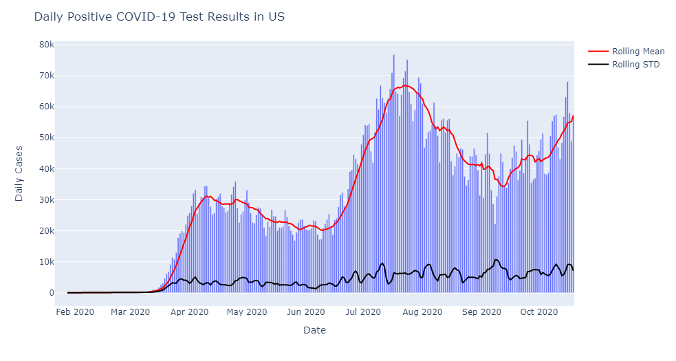
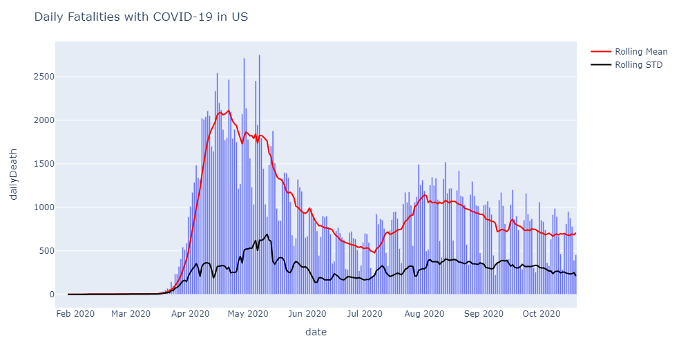

# FORECAST COVIDE-19 Fatalities
ARIMA model to predict Covid19 Fatalities in US

## Objective
This project was conducted to describe the procedures of forecasting the US COVID-19 death toll in 2021 with a 90% confidence interval. 

## Introduction
Many medical research studies have explored and investigated the relationship between COVID-19 fatalities and clinical features, including age, minimum oxygen saturation during encounter, and health-care setting of the patient encounter. These clinical features are highly related to the fatalities, but the time budget and data accessibility made me look into simpler but reliable methods (or approaches). Also, other factors, such as social distancing and wearing masks, are substantial elements that affect the incidence and fatality of COVID-19, but it is difficult to obtain a suitable dataset. Considering the constraints, alongside the rich theory and relatively easy to implement family of ARIMA models, I opted to stay within that arena when forecasting Covid-19 fatalities. All pertinent details of building and evaluating the model are described in the subsequent sections

## Dataset
US COVID-19 data was obtained from [covidtracking.com](covidtracking.com). The dataset includes the cumulative records of daily test numbers, new cases, deaths, hospitalized patients, etc. Then, I performed simple feature engineering to extract non-cumulative daily statistics from the dataset. Note that the obtained dataset period is between January 22, 2020, when the first COVID-19 case was confirmed and reported to CDC, and October 19, 2020. Overall, the original dataset includes 272 records and 10 features

Daily New Cases                                    |  Daily Fatalities
:-------------------------------------------------:|:-------------------------------------------------------:
  |  

g)
## Time Series Model Development

## Forecast Result

## Notebook
Forecast_COVID-19_Fatalities.ipynb
